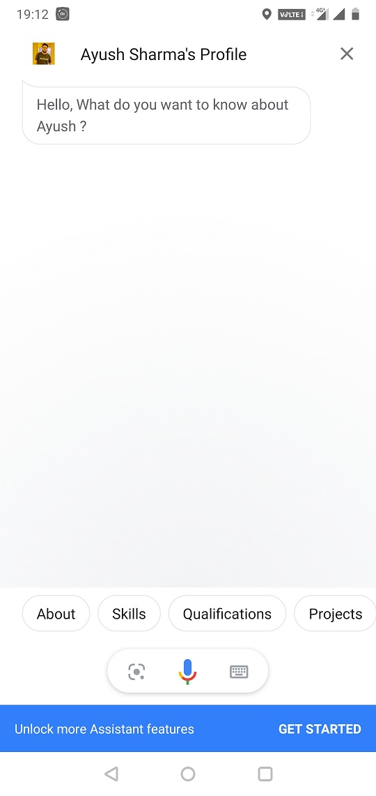
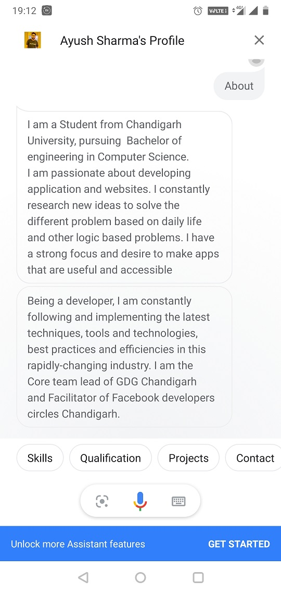
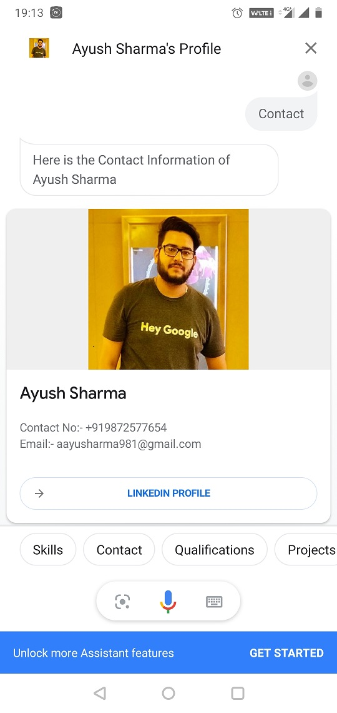
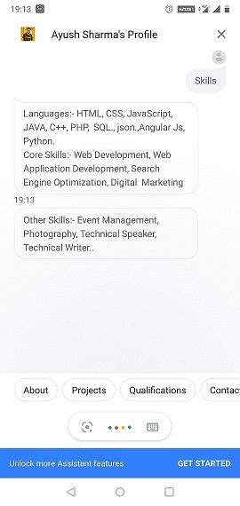

# My-Digital-CV
    

## My DIgital CV
My Digital CV is Interactive Virtual Resume Template which provides basic functionality to develop your own Digital Resume/CV, Which works on Google Assistant and accessible on various supported platforms. You can develop your interactive Digital CV within 20-30 Minutes by using this Dialogflow template. 
### Features 
Easy to use the [template](https://github.com/sharmaaayu981/My-Digital-CV/tree/master/Template) to make a Digital resume that works on Google Assistant.

### Developing Your Digital CV
- Sign-in with Dialogflow and import [Template](https://github.com/sharmaaayu981/My-Digital-CV/tree/master/Template).
- Set Up  Dialogflow Agent
- Link Dialogflow Agent with Google Assistant.
- Download the [Privacy Policy Document](https://github.com/sharmaaayu981/My-Digital-CV/tree/master/Privacy%20Policy) and change it according to your Assistant and upload it on Google Drive and make it public.
- Set up Google Assistant Project
- Deploy Project for Review

### Key Points
1. Setup your DialogFlow Agent by using the [Template](https://github.com/sharmaaayu981/My-Digital-CV/tree/master/Template).
2. Setup Google Assistant Setup.
3. Deploy the project for Review.

### Bonus Point
- [Video Tutorials](https://www.youtube.com/playlist?list=PLnBXWQHTJNuE3_fWm37CGakRIMtJfMRvS) and [Document Tutorials](https://github.com/sharmaaayu981/My-Digital-CV/tree/master/Document%20Tutorials) are available, follow the document step-by-step and make your digital CV better.
- Please see [Sample](https://assistant.google.com/services/a/uid/000000ec94ce6de1?hl=en)
 app for full example. 

### Contributing
Please raise an issue of the requirement so that a discussion can take before any code is written, even if you intend to raise a pull request.

Please see the Tutorial/Setup [Document Tutorials](https://github.com/sharmaaayu981/My-Digital-CV/tree/master/Document%20Tutorials) or [Video Tutorials](https://www.youtube.com/playlist?list=PLnBXWQHTJNuE3_fWm37CGakRIMtJfMRvS) for full references.

### Contact Us
* LinkedIn : https://in.linkedin.com/in/sharmaayush981 
* Email: test1email320@gmail.com
* Twitter: https://twitter.com/i_ayush_sharma

### MIT LIcense
Copyright (c) [2020] [Ayush,Kamal]

Permission is hereby granted, free of charge, to any person obtaining a copy of this software and associated documentation files (the "Software"), to deal in the Software without restriction, including without limitation the rights to use, copy, modify, merge, publish, distribute, sublicense, and/or sell copies of the Software, and to permit persons to whom the Software is furnished to do so, subject to the following conditions:

The above copyright notice and this permission notice shall be included in all copies or substantial portions of the Software.

THE SOFTWARE IS PROVIDED "AS IS", WITHOUT WARRANTY OF ANY KIND, EXPRESS OR IMPLIED, INCLUDING BUT NOT LIMITED TO THE WARRANTIES OF MERCHANTABILITY, FITNESS FOR A PARTICULAR PURPOSE AND NONINFRINGEMENT. IN NO EVENT SHALL THE AUTHORS OR COPYRIGHT HOLDERS BE LIABLE FOR ANY CLAIM, DAMAGES OR OTHER LIABILITY, WHETHER IN AN ACTION OF CONTRACT, TORT OR OTHERWISE, ARISING FROM, OUT OF OR IN CONNECTION WITH THE SOFTWARE OR THE USE OR OTHER DEALINGS IN THE SOFTWARE.
